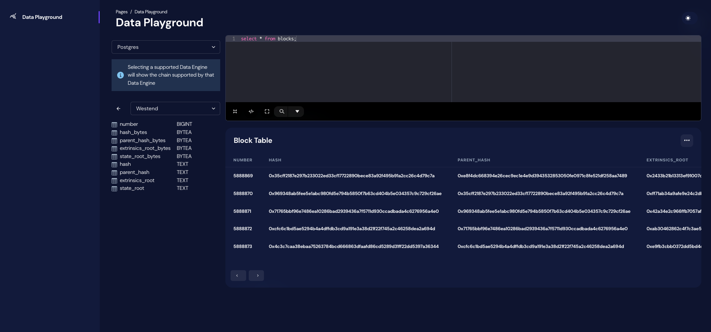
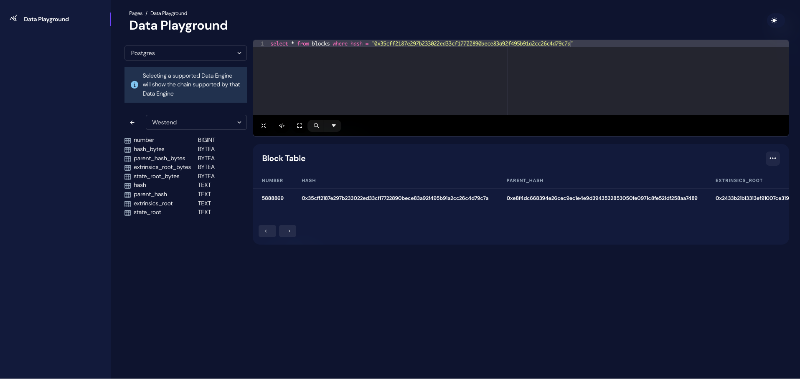

# Hyperdot Data Playground

> This project is only used to validate our data querying and analysis capabilities, and is not intended to be final

## Overview

hyperdot-frontend-end is built using [tailwind css](https://tailwindcss.com/) and [next.js](https://nextjs.org/), creating a modern web dashboard. While it works similar to Dune Analytics, it has its own unique features. Hyperdot-Frontend connects to Hyperdot-Node to provide users with user-friendly chain data analysis capabilities. Moreover, it aims to establish a data analysis community where data engineers and data scientists can create and share insights based on the data provided by Hyperdot.

## Demo

Query blocks

Query blocks by indexing

